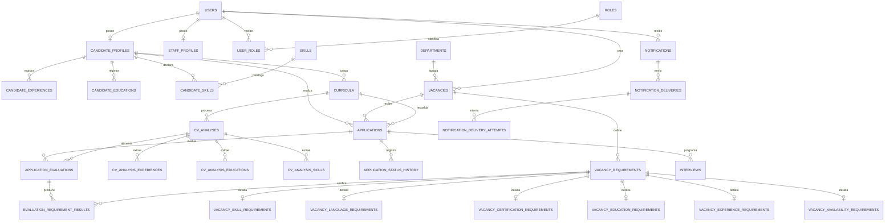

# Diseno de base de datos en tercera forma normal

## Alcance

El modelo cubre usuarios, perfiles, experiencia, formacion, habilidades, plazas, requisitos, curriculum vitae, analisis con IA, postulaciones, resultados, entrevistas, notificaciones e historial de estados.

El diseno inicial esta en `database/schema.sql` y su reversion en `database/rollback.sql`. El esquema vigente en Neon fue traducido completamente al espanol mediante `database/migracion_espanol.sql`.

Los nombres actuales incluyen `usuarios`, `perfiles_aspirantes`, `plazas`, `requisitos_plaza`, `curriculos`, `analisis_cv`, `postulaciones`, `evaluaciones_postulacion` y `notificaciones`. Los modelos Django correspondientes se encuentran en `reclutamiento/models.py`.

## Decisiones principales

- Un `user` contiene identidad y autenticacion. Los datos exclusivos se separan en `candidate_profiles` y `staff_profiles`.
- Un aspirante puede tener varios roles, experiencias, estudios, habilidades, idiomas, certificaciones y curriculum vitae.
- Los archivos PDF no se guardan en PostgreSQL. `curricula` conserva la clave del objeto de Backblaze B2, los metadatos y el hash SHA-256.
- Un analisis de CV estructura lo extraido del PDF. No reemplaza automaticamente la informacion declarada por el aspirante.
- Una postulacion usa un CV concreto. Asi el resultado sigue siendo reproducible aunque el aspirante cargue otro CV despues.
- El analisis de un CV y la evaluacion contra una plaza son procesos distintos. Un mismo CV puede utilizarse para varias plazas sin volver a extraer todo el documento.
- `is_current` permite conservar ejecuciones historicas y seleccionar un unico analisis o evaluacion vigente mediante indices parciales unicos.
- Los requisitos tienen una cabecera comun y un detalle especializado para habilidad, idioma, certificacion, educacion, experiencia o disponibilidad.
- La obligatoriedad y el peso pertenecen al requisito, no a los catalogos de habilidades o idiomas.
- `applications.status_code` guarda el estado actual y `application_status_history` registra cada transicion. Son hechos distintos y ambos dependen directamente de la postulacion.
- La compatibilidad es un resultado versionado. `evaluation_requirement_results` conserva los requisitos cumplidos, faltantes, evidencia y puntuacion.
- Una notificacion es el mensaje para un usuario; sus envios por correo o aplicacion y cada intento se registran por separado.

## De datos no normalizados a 3FN

### Punto de partida no normalizado

Un modelo inicial podria mezclar datos de esta forma:

```text
ASPIRANTE(id, nombre, email, telefonos, habilidades[], experiencias[], estudios[], cvs[])
PLAZA(id, departamento, ciudad, habilidades_obligatorias[], idiomas[], certificaciones[])
POSTULACION(id, nombre_aspirante, titulo_plaza, cv, estado, porcentaje, requisitos_cumplidos[])
```

Ese modelo contiene grupos repetidos, datos multivaluados y nombres duplicados.

### Primera forma normal (1FN)

Cada columna contiene un valor atomico y cada grupo repetido se convierte en filas independientes:

- `candidate_experiences`
- `candidate_educations`
- `candidate_skills`
- `candidate_languages`
- `candidate_certifications`
- `curricula`
- `vacancy_requirements`
- `evaluation_requirement_results`

No se almacenan listas separadas por comas ni columnas como `skill_1`, `skill_2` o `skill_3`.

### Segunda forma normal (2FN)

Las tablas puente solo contienen atributos que dependen de su clave completa:

- En `candidate_skills`, el nivel y los anos dependen de `(candidate_id, skill_id)`.
- En `candidate_languages`, el dominio depende de `(candidate_id, language_id)`.
- En `evaluation_requirement_results`, cumplimiento y puntuacion dependen de `(evaluation_id, requirement_id)`.
- En `user_roles`, la fecha de asignacion depende de `(user_id, role_id)`.

Los datos propios del aspirante, habilidad, idioma o requisito no se copian en esas tablas.

### Tercera forma normal (3FN)

Se eliminan dependencias transitivas:

- La postulacion referencia al aspirante y a la plaza; no repite sus nombres.
- La plaza referencia al departamento; no guarda tambien el nombre del departamento.
- La ciudad referencia a la region y la region al pais. La plaza no repite region y pais.
- Habilidades, idiomas, certificaciones, niveles educativos y ocupaciones son catalogos independientes.
- Los nombres de estados se encuentran en catalogos; las entidades operativas guardan sus codigos.
- El proveedor y modelo de IA se separan de la configuracion versionada del motor de analisis.
- Los datos de entrega SMTP no se repiten dentro de la notificacion.

Todos los atributos no clave dependen de la clave, de toda la clave y de nada mas que la clave.

## Modelo entidad-relacion resumido



## Relaciones y cardinalidades

| Relacion | Cardinalidad | Regla |
|---|---:|---|
| Usuario - perfil de aspirante | 1:0..1 | Solo los usuarios aspirantes requieren este perfil. |
| Usuario - rol | N:M | Un administrador tambien puede trabajar en RR. HH. |
| Aspirante - CV | 1:N | Se admiten uno o varios archivos. |
| Aspirante - plaza | N:M | Se resuelve mediante `applications`. |
| Plaza - requisito | 1:N | Cada requisito tiene un solo tipo y detalle especializado. |
| CV - analisis | 1:N | Permite reprocesar con otra version del motor. |
| Postulacion - evaluacion | 1:N | Permite recalcular y auditar resultados historicos. |
| Evaluacion - requisito | N:M | Se resuelve mediante los resultados por requisito. |
| Postulacion - estado historico | 1:N | Registra quien hizo cada cambio y cuando. |
| Notificacion - entrega | 1:N | Una notificacion puede entregarse en aplicacion y por correo. |

## Reglas de integridad

- Un usuario no puede repetir correo, incluso con diferencias de mayusculas, gracias a `CITEXT`.
- Un aspirante solo puede postularse una vez a cada plaza.
- La fecha final de una experiencia o estudio no puede ser anterior a su inicio.
- Los salarios y anos de experiencia no pueden ser negativos.
- Los porcentajes y niveles de confianza se limitan a sus rangos validos.
- Solo puede existir un analisis vigente por CV y una evaluacion vigente por postulacion.
- El hash SHA-256 permite detectar documentos iguales sin impedir su registro y auditoria.
- La eliminacion de una plaza o postulacion historica se restringe; los detalles dependientes usan eliminacion en cascada cuando corresponde.

Hay dos reglas que deben validarse dentro de una transaccion del servicio Django:

1. Cada `vacancy_requirement` debe poseer exactamente un detalle, y este debe coincidir con `kind_code`.
2. Cada requisito evaluado debe pertenecer a la misma plaza que la postulacion evaluada.

No se implementan como triggers para mantener las reglas de negocio visibles en el dominio y en sus pruebas.

## Indices y consultas previstas

- Todas las claves foraneas usadas en joins tienen indice.
- `applications(vacancy_id, status_code, applied_at)` soporta filtros del dashboard de RR. HH.
- El indice parcial de evaluaciones vigentes por compatibilidad soporta el ranking de aspirantes.
- Los indices parciales de plazas publicadas y notificaciones no leidas evitan recorrer datos historicos.
- `pg_trgm` acelera busquedas parciales por nombre, profesion, empresa, puesto y habilidad.
- `curricula(checksum_sha256)` permite detectar CV duplicados.

Los conteos del dashboard, como cantidad de aspirantes por plaza, deben calcularse con `COUNT` sobre `applications`; no se almacenan como columnas porque serian datos derivados susceptibles a inconsistencias.

## Datos sensibles

- `password_hash` debe contener exclusivamente hashes generados por Django; nunca contrasenas en texto plano.
- Telefonos, direcciones, texto extraido y CV requieren controles de acceso y cifrado en transito y reposo.
- La clave de Backblaze B2 no debe ser una URL publica. La aplicación genera URLs firmadas de corta duración.
- Los resultados de IA deben conservar la version del motor y permitir revision humana; no deben ser la unica base para rechazar automaticamente a una persona.

## Uso del DDL

Crear una base vacía y ejecutar:

```powershell
python manage.py migrate --noinput
python manage.py aplicar_migraciones --instalar-esquema --inicializar-catalogos
```

`--instalar-esquema` ejecuta `database/schema.sql` y después
`database/migracion_espanol.sql` cuando no encuentra el esquema de negocio.
Las versiones posteriores se leen desde `database/migraciones` y se registran
en `esquema_migraciones`.

Revertir el esquema:

```powershell
psql -d sistema_cv -f database/rollback.sql
```

Los modelos Django actuales usan `managed = False`; por eso no se ejecutan
migraciones nativas para estas tablas. El DDL inicial y los cambios posteriores
se aplican exclusivamente mediante el instalador y las migraciones SQL
versionadas para evitar que dos mecanismos intenten crear las mismas tablas.
